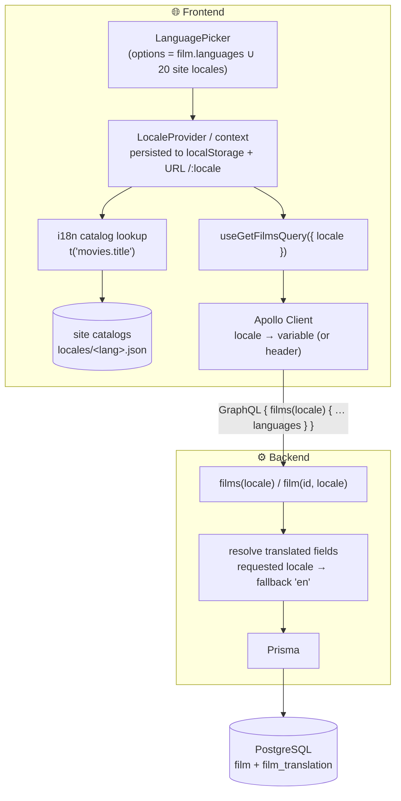
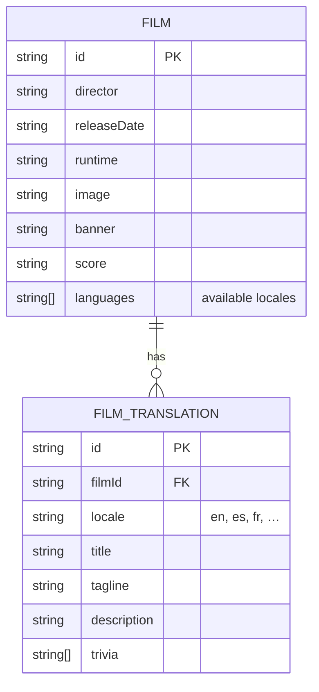
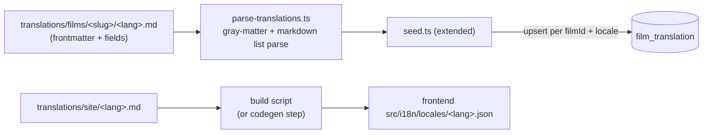

# Target Architecture — Making the app i18n-ready

A proposed design for the take-home. The guiding insight: there are **two
distinct kinds of translatable content**, and each wants a different home.

| Kind | Source | Coverage | Where it belongs |
|------|--------|----------|------------------|
| **Site UI strings** (headings, buttons, errors, field labels like "Director", units like "min") | `translations/site/<lang>.md` | All **20** languages, uniform | **Frontend** message catalog — static, no DB round-trip |
| **Film content** (title, tagline, description, trivia) | `translations/films/<slug>/<lang>.md` | **Uneven** per film (1–20) | **Backend** — data-driven, localized via GraphQL with `en` fallback |

Locale-invariant film fields (`image`, `banner`, `score`, `releaseDate`,
`runtime`, `director`) stay on the base `Film` row and are **not** translated.

## Locale data flow



The UI-string path never touches the network; the film-content path threads
`locale` to the backend, which returns localized fields (or English when a film
lacks that locale).

## Data model — add a translation table



`FILM_TRANSLATION` has a unique constraint on `(filmId, locale)`. The locale-
invariant columns drop off `Film` into nothing new — they just stay put; only
the four translatable fields move into the translation table (with `en` as one
row per film, so English is data, not a special case).

**Why a table over the alternatives:** a JSON `translations` column on `Film`
works and is less migration effort, but a table gives referential integrity, an
indexable `(filmId, locale)` lookup, and a natural place to enforce "render only
what exists." A column-per-locale approach is rejected — it doesn't scale to 20
languages and bakes coverage into the schema.

## Ingestion pipeline — Markdown → database

The `translations/*.md` files are the source of truth, so add a **parse step**
to the existing seed rather than hand-copying content.



- **Film copy** is parsed and seeded into `film_translation`. The film's
  `languages` array is derived from which translation rows exist (single source
  of truth — no drift between `languages` and actual coverage).
- **Site copy** is converted to JSON catalogs the frontend imports. Each bullet
  in the Markdown maps to a stable key (e.g. `welcome.hero.headline`,
  `movies.error.load`, `film.label.director`, `film.runtimeUnit`).

## GraphQL schema changes

```graphql
type Query {
  films(locale: String = "en"): [Film!]!
  film(id: ID!, locale: String = "en"): Film
}

type Film {
  id: ID!
  # translatable — resolved for the requested locale, falling back to en
  title: String!
  tagline: String!
  description: String!
  trivia: [String!]!
  # locale-invariant
  director: String!
  releaseDate: String!
  runtime: String!
  image: String!
  banner: String!
  score: String!
  languages: [String!]!   # locales this film actually has
}
```

`locale` can travel as a query argument (shown) or an `Accept-Language` /
custom header read in `createContext` — argument is simpler and explicit; header
is more REST-idiomatic. Either way the resolver does: requested locale → row in
`film_translation` → else the `en` row.

## Frontend changes

- **i18n runtime:** add `i18next` + `react-i18next` (or `react-intl`). Wrap the
  app in a provider alongside the existing `ApolloProvider`/`ThemeProvider` in
  `index.tsx`. Replace every hardcoded string (`Welcome.tsx`, `MoviesHeader.tsx`,
  `Movies.tsx` errors, `ErrorPage`, `NotFound`, field labels in `FilmCard`) with
  `t('…')` calls.
- **LanguagePicker:** a new shared component in `MoviesHeader` / a global nav.
  Per the brief, **only offer the languages that exist** — site locales for UI,
  and for a given film its `languages` list (disable/hide the rest).
- **Locale propagation:** store in a `LocaleProvider`, persist to `localStorage`,
  optionally reflect in the URL (`/:locale/movies`) for shareable links. Pass the
  active locale as the `locale` variable to `useGetFilmsQuery`.
- **RTL:** Arabic (`ar`) is in scope — set `dir="rtl"` and flip the MUI theme
  direction when an RTL locale is active.
- **Regenerate hooks:** after editing the GraphQL op to take `$locale`, run
  `pnpm codegen` so `useGetFilmsQuery` accepts it.

## Cross-cutting / edge cases

- **Fallback rule** is explicit and central: missing locale → `en`. Surface it
  once in the resolver, not scattered in the UI.
- **Coverage honesty:** `languages` is derived from seeded rows, so the picker
  can never offer a translation that isn't there.
- **Formatting:** use `Intl.NumberFormat` / `Intl.DateTimeFormat` for the score
  and any numbers/dates rather than string concatenation, so locale conventions
  (decimal separators, digit systems for `ar`/`hi`) are respected.
- **SEO/meta:** the site catalog includes an app description — set `<html lang>`
  and meta per active locale.

## Separate commits for better readability

The work shipped as five focused, independently-reviewable commits

1. **Data & ingestion** — the `FilmTranslation` model and migration, plus a
   Markdown parser that the seed uses to load per-film copy. Additive and
   non-breaking: the English columns stay, and `languages` is derived from the
   rows actually seeded.
2. **GraphQL** — a `locale` argument on `films`/`film`, resolvers that localize
   the translatable fields with English fallback (the fallback lives in one
   place), and the regenerated SDL.
3. **Frontend i18n runtime** — `i18next`/`react-i18next`, site catalogs generated
   from `site/*.md`, type-checked `t()` keys, and every hardcoded string swapped.
4. **Language picker & locale propagation** — a global picker, locale persisted to
   `localStorage` and applied to `<html lang>`/`dir`, the locale threaded to the
   GraphQL query, and direction-aware theming for RTL. Includes an Apollo cache
   fix (`Film` keyed per locale) so switching back to a language never shows
   stale, normalization-collided copy.
5. **Polish** — `Intl.NumberFormat` for scores/years/runtime, localized
   document title and meta description, and the README write-up. (Implementation
   surfaced that CLDR 44 changed `ar`'s default digits to Latin — so the formatter
   follows locale defaults rather than forcing Arabic-Indic.)
